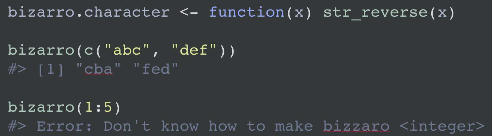

Use `venue = "rtf"` to get output in [Rich Text Format](https://en.wikipedia.org/wiki/Rich_Text_Format). This is useful for creating syntax highlighted code snippets -- rendered or not -- for pasting into software such as Keynote or PowerPoint.

This feature is very experimental (*available only in the dev version on GitHub*), rather limited, and subject to change. It probably only works on macOS and requires the installation of the
[highlight](http://www.andre-simon.de/doku/highlight/en/highlight.php) command line tool. If you use [homebrew](https://brew.sh), here's an easy way to install from the shell:

```
brew install highlight
```

Here is the highlight call implied by the default behaviour of `reprex(..., venue = "rtf")`:

```
highlight foo_reprex.md --out-format rtf --no-trailing-nl --style darkbone --font 'Courier Regular' --font-size 50 > foo_reprex.rtf
```

It would be preferable to use something like [highlight package](https://cran.r-project.org/web/packages/highlight/index.html) at some point in the future, but we will experiment with this in the meantime.

## Basic usage

Let's reprex some code and stick it on a Keynote slide with other non-R "features".

```{r eval = FALSE}
reprex({
  (x <- rnorm(3))
  mean(x)
}, venue = "rtf")
```

```{r echo = FALSE, out.width = "75%"}
knitr::include_graphics("keynote-w00t.png")
```

## highlight options

If you don't like the defaults, control highlight command line arguments by setting `reprex.highlight.*` options.

Example of setting options in `.Rprofile`:

```{r eval = FALSE}
options(
  reprex.highlight.hl_style  = "darkbone",
  reprex.highlight.font      = "Source Code Pro",
  reprex.highlight.font_size = 50
)
```

The supported options are `reprex.highlight.hl_style`, `reprex.highlight.font`, `reprex.highlight.font_size` (all shown above), and `reprex.highlight.other` (a catchall for anything else, shown below).

You could set options for all your reprexing by doing this in your user-level `.Rprofile`. Create or open this file via `usethis::edit_r_profile()`.

You could also set options for a specific Project in `.Rprofile` inside the Project. Create or open this file via `usethis::edit_r_profile("project")`.
 
`hl_style` must be one of your existing highlight themes and `font` must be one of your installed fonts.

List available themes:

```
highlight --list-scripts=themes
```

Galleries of highlighting styles (likely to overlap with the ones you have):

<http://www.andre-simon.de/doku/highlight/en/theme-samples.php>  
<https://rclickhandbuch.files.wordpress.com/2014/09/knitrthemesoverview.pdf>

You can also override defaults on-the-fly. Here's how to do that for a single call using withr:

```{r dusk-fira-35-line-numbers, eval = FALSE}
withr::with_options(
  new = c(
    reprex.highlight.hl_style  = "dusk",
    reprex.highlight.font      = "Fira Code Regular",
    reprex.highlight.font_size = 35,
    reprex.highlight.other     = "--line-numbers --line-number-length=2 -z"
  ),
  reprex::reprex(input = c("(x <- rnorm(3))", "mean(x)"), venue = "rtf")
)
```

```{r echo = FALSE, out.width = "60%"}
knitr::include_graphics("dusk-fira-35-line-numbers.png")
```

Here's how to set highlight options for part of an R session:

```{r anotherdark-andale-60-line-numbers, eval = FALSE}
op <- options(
  reprex.highlight.hl_style  = "anotherdark",
  reprex.highlight.font      = "Andale Mono Regular",
  reprex.highlight.font_size = 60,
  reprex.highlight.other     = "--line-numbers"
)

reprex::reprex(input = c("(x <- rnorm(3))", "mean(x)"), venue = "rtf")

options(op)
```

```{r echo = FALSE, out.width = "85%"}
knitr::include_graphics("anotherdark-andale-60-line-numbers.png")
```

## Render ... or not

If you just want to highlight code, but not render it, set chunk option `eval = FALSE` option, i.e. put a special comment as the first line of your reprex source:

```{r eval-false, eval = FALSE}
#+ eval = FALSE
(x <- rnorm(3))
mean(x)
```

The above source, when `reprex()`ed, will not include the usual output. This is not specific to `venue = "rtf"`, but it's more likely to come up in this setting.

```{r echo = FALSE, out.width = "20%"}
knitr::include_graphics("eval-false.png")
```

## How to selectively hide and reveal code

When preparing snippets for a presentation, you may not have the luxury of making each snippet completely self-contained. In the future, we may create a way to run the reprex in the current workspace, as opposed to the usual reprex practice of using a separate R process. For now you can use chunk options to selectively hide code, i.e. to run a large snippet, but only include a small bit in the output.

This is easiest to show by example. If you `reprex()` this code, only the last three lines and their output will appear in the output. But the other lines will be run, i.e. `str_reverse()` will be defined, as will the `bizzaro()` generic and default method.

```{r bizarro-selective-reveal, eval = FALSE}
#+ include = FALSE
str_reverse <- function(x) {
  vapply(
    strsplit(x, ""),
    FUN = function(z) paste(rev(z), collapse = ""),
    FUN.VALUE = "")
}

#+ include = FALSE
bizarro <- function(x) {
  UseMethod("bizarro")
}
bizarro.default <- function(x) {
  stop(
    "Don't know how to make bizzaro <",
    class(x)[[1]], ">",
    call. = FALSE
  )
}

#+ include = TRUE
bizarro.character <- function(x) str_reverse(x)

bizarro(c("abc", "def"))

bizarro(1:5)
```

```{r echo = FALSE, out.width = "70%"}

```
