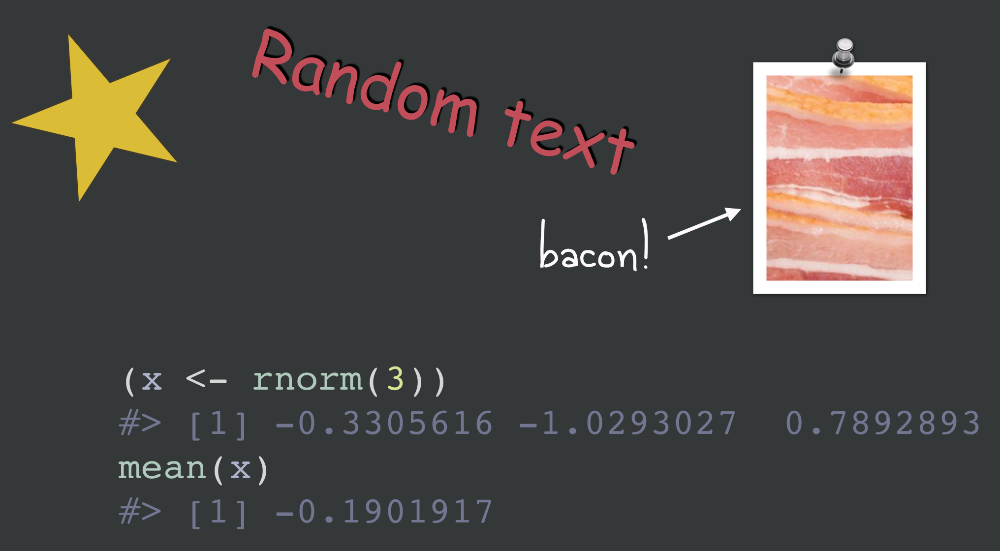

Use `reprex_rtf()` to get output in [Rich Text Format](https://en.wikipedia.org/wiki/Rich_Text_Format).
It is a convenience wrapper around `reprex(venue = "rtf")`.
This is useful for creating syntax highlighted code snippets -- rendered or not -- to paste into software such as Keynote, PowerPoint, or Word.

Why is RTF special?
Although Pandoc can produce RTF and, therefore, so can `rmarkdown::render()` and `reprex::reprex()`, Pandoc's syntax highlighting is unavailable for RTF output.
For now, we've got to get the functionality from somewhere else.
Syntax highlighting is a non-issue for `venue = "gh"` (GitHub) and `venue = "so"` (Stack Overflow), because the target sites take care of that when the Markdown content is displayed.

<p>
<div style="height: auto">

</div>
</p>

The "rtf" venue was introduced in reprex v0.2.1 and is experimental.
The [highlight](http://www.andre-simon.de/doku/highlight/en/highlight.php) command line tool must (1) be installed and (2) be on your `PATH`.
People have successfully used `reprex_rtf()` on macOS and Windows (specifically, Windows 10 + Windows PowerShell 5.1).
We consider it experimental because of the rather hacky way we shell out to highlight and, long-term, it would be preferable to get syntax-highlighted RTF through a proper R package.
The existing [highlight R package](https://cran.r-project.org/package=highlight) can't do this (yet?).

### How to install highlight

The highlight website offers downloads in various forms, for various OSes:

* <http://www.andre-simon.de/zip/download.php>

For macOS users who use [homebrew](https://brew.sh), this works:

```{sh eval = FALSE}
brew install highlight
```

For Windows users who use [chocolatey](https://chocolatey.org/), this works:

```{sh eval = FALSE}
choco install highlight
```

On Windows, the chocolatey method did not add highlight to my `PATH` and this could affect other methods of installation as well.
In this case, you'll [need to do this manually](https://www.maketecheasier.com/what-is-the-windows-path/).
In my case, I needed to add `C:\Program Files\Highlight` to `PATH`.
A second issue we've seen is with the scoop package manager for Windows, which uses a shim-based method of making the executables it installs findable.
The shim method appears to be less resilient to the different ways of calling highlight from R.

`reprex_rtf()` should work when `Sys.which("highlight")`, executed in R, correctly returns the path to your highlight executable.

Here's how that looks for me on macOS:

```{r eval = FALSE}
Sys.which("highlight")
#>                  highlight 
#> "/usr/local/bin/highlight" 
```

and on Windows:

```{r eval = FALSE}
Sys.which("highlight")
#>                              highlight 
#> "C:\\PROGRA~1\\HIGHLI~1\\HIGHLI~2.EXE" 
```

Here is the highlight call implied by the default behaviour of `reprex_rtf()`:

```{sh eval = FALSE}
highlight -i foo_reprex.R --out-format rtf --no-trailing-nl --encoding=UTF-8 --style darkbone --font 'Courier Regular' --font-size 50 -o foo_reprex.rtf
```

## Basic usage

Let's reprex some code and stick it on a Keynote slide with other non-R "features".

```{r eval = FALSE}
reprex({
  (x <- rnorm(3))
  mean(x)
}, venue = "rtf")
```

```{r echo = FALSE, out.width = "75%"}

```

## highlight options

If you don't like the defaults, control highlight command line arguments by setting `reprex.highlight.*` options.
Why options?
I didn't want to burden `reprex()` with even more arguments and this is usually something you want to set globally for yourself or for an entire project or talk or course.

Set these options with code like this:

```{r eval = FALSE}
options(
  reprex.highlight.hl_style  = "darkbone",
  reprex.highlight.font      = "Source Code Pro",
  reprex.highlight.font_size = 50
)
```

The supported options are `reprex.highlight.hl_style`, `reprex.highlight.font`, `reprex.highlight.font_size` (all shown above), and `reprex.highlight.other` (a catchall for anything else, shown below).

You could set options for all your reprexing by doing this in your user-level `.Rprofile`. Create or open this file via `usethis::edit_r_profile()`.

You could also set options for a specific Project in `.Rprofile` inside the Project. Create or open this file via `usethis::edit_r_profile("project")`.

Finally, you might collect all of the R snippets destined for inclusion in, e.g. some talk slides, in a `.R` file.
It would make sense to set the `reprex.highlight.*` options at the start of that file.

`hl_style` must be one of your existing highlight themes and `font` must be one of your installed fonts.

List available themes:

```{sh eval = FALSE}
highlight --list-scripts=themes
```

But what do these themes *look like*?
Here are some galleries that probably have high overlap with your themes:

<http://www.andre-simon.de/doku/highlight/en/theme-samples.php>  
<https://rclickhandbuch.files.wordpress.com/2014/09/knitrthemesoverview.pdf>

You can also override defaults on-the-fly.
Here's how to do that for a single call using withr and, as a bonus, how to use `reprex.highlight.other` to send arbitrary command line arguments to highlight:

```{r dusk-fira-35-line-numbers, eval = FALSE}
withr::with_options(
  new = c(
    reprex.highlight.hl_style  = "dusk",
    reprex.highlight.font      = "Fira Code Regular",
    reprex.highlight.font_size = 35,
    reprex.highlight.other     = "--line-numbers --line-number-length=2 --zeroes"
  ),
  reprex::reprex(input = c("(x <- rnorm(3))", "mean(x)"), venue = "rtf")
)
```

```{r echo = FALSE, out.width = "60%"}
knitr::include_graphics("img/dusk-fira-35-line-numbers.png")
```

Here's how to set highlight options for part of an R session:

```{r anotherdark-andale-60-line-numbers, eval = FALSE}
op <- options(
  reprex.highlight.hl_style  = "anotherdark",
  reprex.highlight.font      = "Andale Mono Regular",
  reprex.highlight.font_size = 60,
  reprex.highlight.other     = "--line-numbers"
)

reprex::reprex(input = c("(x <- rnorm(3))", "mean(x)"), venue = "rtf")

options(op)
```

```{r echo = FALSE, out.width = "85%"}
knitr::include_graphics("img/anotherdark-andale-60-line-numbers.png")
```

Experience has shown that it is hard to predict which aspects of the RTF will be honored when you paste into the target document.
We're talking about things like the font size or background color.
This seems to vary greatly across applications and operating systems and you'll just have to experiment to find a workflow that is practical for you.

Note that it is even possible to create a custom highlight theme, e.g. to match the theme of a Keynote or Powerpoint slide deck with respect to background color, font, etc.
A specific example of this is documented in these [how-to notes](https://github.com/jennybc/debugging/blob/master/how-to/highlight-custom-theme.md).

## Run ... or not

If you just want to highlight code, but not run it, set chunk option `eval = FALSE` option, i.e. put a special comment as the first line of your reprex source:

```{r eval-false, eval = FALSE}
#+ eval = FALSE
(x <- rnorm(3))
mean(x)
```

The above source, when `reprex()`ed, will not include the usual output.
This is not specific to `venue = "rtf"`, but it's more likely to come up in this setting.

```{r echo = FALSE, out.width = "20%"}
knitr::include_graphics("img/eval-false.png")
```

## What if each snippet can't be self-contained?

### `reprex:::prex()` and friends

When preparing bits of code for a presentation, it can be impractical to make each snippet completely self-contained.
You really need to run the snippets in the current workspace and session. But `reprex()` does not allow this.

The **unexported** function `prex()` addresses this use case.
It's like `reprex()`, but much less reproducible!

  * Code is evaluated in the global environment of the current R session.
  * Current working directory is used.
  * `advertise = FALSE` is the default.

`prex()` also has "venue as suffix" variants, so `reprex:::prex_rtf(...)` is short for `reprex:::prex(..., venue = "rtf")`.

This code defines `x` and `y` in the current workspace and writes the file `stuff.txt` to the current working directory.

```{r eval = FALSE}
x <- 1
y <- 4
writeLines("blah blah", file.path(getwd(), "stuff.txt"))
```

Now we can show the difference between `prex()` and `reprex()`.

```{r eval = FALSE}
prex({
  ls()
  x + y
  readLines("stuff.txt")  
})
```

yields

```{r eval = FALSE}
ls()
#> [1] "x" "y"
x + y
#> [1] 5
readLines("stuff.txt")
#> [1] "blah blah"
```

`x` and `y` can be found, even though they aren't defined in the snippet, and `stuff.txt` can be read.

This is very different from executing the same code via `reprex()`:

```{r eval = FALSE}
reprex({
  ls()
  x + y
  readLines("stuff.txt")  
})
```

which yields:

```{r eval = FALSE}
ls()
#> character(0)
x + y
#> Error in eval(expr, envir, enclos): object 'x' not found
readLines("stuff.txt")
#> Warning in file(con, "r"): cannot open file 'stuff.txt': No such file or
#> directory
#> Error in file(con, "r"): cannot open the connection
```

`x` and `y` can't be found, because `reprex()` works in a clean session, and `stuff.txt` can't be found, because `reprex()` works in a temp directory, by default.

If you're going to `prex()` a lot, you'll want to do something like this in your `.R` file of snippets or in the project-specific or user-level `.Rprofile`:

```{r eval = FALSE}
prex <- reprex:::prex
prex_rtf <- reprex:::prex_rtf
```

## Selectively hide and reveal code

*Before `prex()` existed, you had to use a more cumbersome technique to produce small snippets, by hiding code.
We leave this here in case it is still useful in some situations.*

You can use knitr chunk options to selectively hide code, i.e. to run a large snippet, but only include a small bit in the output.

This is easiest to show by example.
If you `reprex()` this code, only the last three lines and their output will appear in the output.
But the other lines will be run, i.e. `str_reverse()` will be defined, as will the `bizzaro()` generic and default method.

```{r bizarro-selective-reveal, eval = FALSE}
#+ include = FALSE
str_reverse <- function(x) {
  vapply(
    strsplit(x, ""),
    FUN = function(z) paste(rev(z), collapse = ""),
    FUN.VALUE = "")
}

#+ include = FALSE
bizarro <- function(x) {
  UseMethod("bizarro")
}
bizarro.default <- function(x) {
  stop(
    "Don't know how to make bizzaro <",
    class(x)[[1]], ">",
    call. = FALSE
  )
}

#+ include = TRUE
bizarro.character <- function(x) str_reverse(x)

bizarro(c("abc", "def"))

bizarro(1:5)
```

```{r echo = FALSE, out.width = "70%"}
knitr::include_graphics("img/bizarro-selective-reveal.png")
```
